## Why QCD topology matters {auto-animate=true }

::: {class="fragment"}
- Different $Q$-sectors correspond to **distinct vacua** with non-trivial topological structure
:::

::: {class="fragment" style="text-align:center; margin-top:-90px;"}

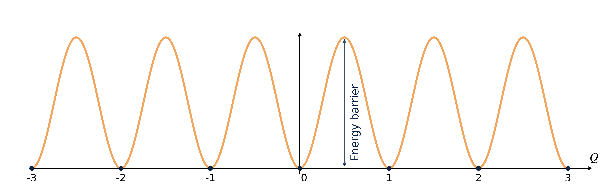

:::

## Why QCD topology matters {auto-animate=true auto-animate-duration=0.5}

- Different $Q$-sectors correspond to **distinct vacua** with non-trivial topological structure

::: {class="fragment" style="margin-top:-10px"}
- Topology underlies key QCD phenomena:
  - Witten–Veneziano mechanism → $m_{\eta'~}$
  - Strong-CP problem ($\theta$-term)
  - Topological susceptibility in QCD thermodynamics
:::

::: {.fragment style="margin-top:-10px; font-size=0em;"}

 .

:::
::: { style="text-align:center;  margin-top:-70px;"}

:::

::: {class="fragment" style="font-size:1.0em; font-style:italic; color:gray; margin-top:-10px; margin-left:48%; text-align:left;"}
Understanding QCD topology is essential  for [**hadron physics**]{style="color: #EB811B;"} and [**finite-temperature QCD**]{style="color: #EB811B;"}.
:::

## Real-time transitions: the Sphaleron Rate {auto-animate=true}

::: columns
::: column 
:::{class="fragment"}

[σφαλερός]{style="font-weight:450;"} *(sphalerós)*

  <ol>
    <li class=""> **slippery**, likely to make one stumble</li>
    <li class="">ready to fall</li>
  </ol>

:::

:::

::: column 
::: {class="fragment"}

[Sphaleron Rate:]{style="font-weight:450;"}

Rate of [real time]{style="font-weight:450;"} thermal transitions above sphaleron barriers separating topologically-inequivalent QCD vacua

:::

:::

:::

## Real-time transitions: the Sphaleron Rate

::: columns
::: column 
:::{class=""}

[σφαλερός]{style="font-weight:450;"} *(sphalerós)*

  <ol>
    <li class=""> **slippery**, likely to make one stumble</li>
    <li class="">ready to fall</li>
  </ol>

:::

:::

::: column 
::: {class=""}

[Sphaleron Rate:]{style="font-weight:450;"}

Rate of [real time]{style="font-weight:450;"} thermal transitions above sphaleron barriers separating topologically-inequivalent QCD vacua

:::

:::

:::

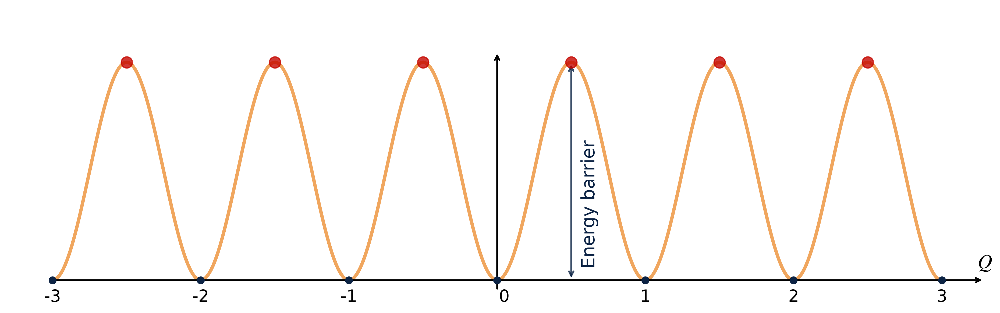

## Real-time transitions: the Sphaleron Rate {auto-animate=true}

::: columns
::: column 
:::{class=""}

[σφαλερός]{style="font-weight:450;"} *(sphalerós)*

  <ol>
    <li class=""> **slippery**, likely to make one stumble</li>
    <li class="">ready to fall</li>
  </ol>

:::

:::

::: column 
::: {data-id="def"}

[Sphaleron Rate:]{style="font-weight:450;"}

Rate of [real time]{style="font-weight:450;"} thermal transitions above sphaleron barriers separating topologically-inequivalent QCD vacua

:::

:::

:::

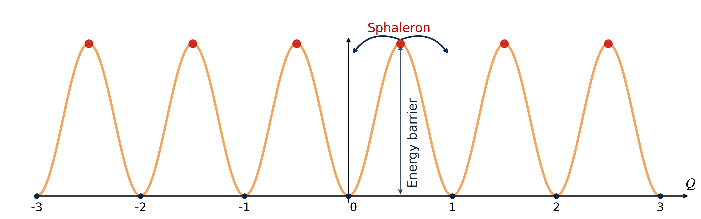

## Real-time transitions: the Sphaleron Rate {auto-animate=true}
::: columns
::: column 
::: {data-id="def"}

[Sphaleron Rate:]{style="font-weight:450;"}

Rate of [real time]{style="font-weight:450;"} thermal transitions above sphaleron barriers separating topologically-inequivalent QCD vacua

:::

:::

::: column 

:::{class="fragment"}
$$
\Gamma_{\mathrm{sphal}} \equiv \int dt d^3x ~\langle q(\vec{x},t) q(\vec{0},0)\rangle _T
$$
:::

:::{class="fragment"}
$$
\langle \mathcal{O} \rangle _T = \frac{1}{\mathrm{Tr}\{ e^{-\mathcal{H}/T} \}} \mathrm{Tr}\{e^{- \mathcal{H}/T} \mathcal{O}\}
$$
:::

:::

:::

::: {class="fragment fade-up" style="font-size:1.0em; font-style:italic; color:gray; margin-top:-10px; margin-left:68%; text-align:left; font-size: 1.7rem"  }
[**Why do we care?**]{style="color: #EB811B; font-size:1.9rem"}
:::

## Axion Cosmology needs the rate at finite $p$

::: {class="fragment" data-fragment-index="1" style="margin-bottom: 22px; border-left: 5px solid #EB811B; padding-left: 15px; background: rgba(235, 129, 27, 0.05);"}
**The Axion:**  A pseudo-Goldstone boson proposed to solve the **Strong CP Problem**
 and also a leading **Dark Matter** candidate.
:::

::: {class="fragment" data-fragment-index="2" style="font-size: 0.95em;"}
**Thermal production in the Early Universe** ($\small T \sim T_c \div 10\, T_c$): the axion relic abundance follows from a [**momentum-dependent**]{style="color: #EB811B;"} Boltzmann equation [[3]]{color=gray}
$$ \small \frac{df_{\vec{p}}}{dt} = \left(1+f_{\vec{p}}\right)\Gamma_{a}^{(+)}(p) - f_{\vec{p}}\,\Gamma_{a}^{(-)}(p) $$
:::

::: {class="fragment" data-fragment-index="3" style="margin-bottom: 10px; border-left: 5px solid rgba(4, 41, 110, 0.84); padding-left: 15px; background: rgba(13, 61, 150, 0.04);"}
**The Key Input:**
the axion interaction rates are fixed by the **topological rate** at [on-shell]{style="font-weight:450;"} four-momentum:

$$ \small \Gamma_a^{(-)}(p)=e^{E_p/T}\, \Gamma_a^{(+)}(p)=\frac{\Gamma_{\text{top}}(\omega = E_p,\, p)}{2 E_p f_a^2}, \qquad E_p = \sqrt{m_a^2 + p^2} \simeq p $$

:::

::: {class="fragment" data-fragment-index="4" style="font-size:0.95em; font-style:italic; color:gray; margin-top: 14px; margin-left:8%; text-align:left;"}
Higher momenta decouple **later** from the thermal bath: axion production may equilibrate  
at different times depending on $p$ $~\Rightarrow~$ [we need $\Gamma_{\mathrm{top}}$ at **finite momentum**]{style="color: #EB811B;"}
:::

## This work

::: {style="text-align:center; margin-top: 2.2em;"}
The full momentum-dependent generalization of the sphaleron rate:
:::

$$
\Gamma_{\mathrm{top}}(\omega,p) = \int dt\, d^3x~ e^{\,i x_\mu p^\mu}\, \langle q(\vec{x},t)\, q(\vec{0},0)\rangle _T\,,
\qquad p_\mu = (\omega, \vec p)
$$

::: {.fragment style="margin-top: 0.6em;"}
- $\;\Gamma_{\mathrm{sphal}} = \lim_{\omega,\,p \to 0} \Gamma_{\mathrm{top}}(\omega,p)$: computed on the lattice in pure gauge [[7]]{color=gray} and full QCD [[8]]{color=gray}
- $p \neq 0$: **essentially unexplored** non-perturbatively
:::

::: {.fragment .eqbox style="display:block; width:max-content; margin:0.7em auto; text-align:center; margin-top:2.5em;"}
**This talk**: proof-of-concept in quenched SU(3) at $T \simeq 1.24\,T_c \simeq 360$ MeV: 
$\Gamma_{\mathrm{top}}(\omega, p)$ for momenta up to $p/T \sim 10$, both **off-shell** and **on-shell** ($\omega = p$)
:::

::: {.fragment .lead style="text-align:center; margin-top:1.0em"}
A controlled feasibility study in view of the (much more expensive) full-QCD case.
:::

## From Real Time to Euclidean Time

- The topological rate is a Real-Time transport coefficient  but the lattice lives in **Euclidean time** ($t \to -i\tau$, $\;0 \le \tau \le 1/T$).

::: {class="fragment fade-in" data-fragment-index="1"}
- What we can measure is the **Euclidean correlator** at spatial momentum $\vec p$:
$$ G_E(\tau, p) = \int d^3x \; e^{\,i\vec{p}\cdot\vec{x}}\, \langle q(\vec{x}, \tau)\, q(\vec{0}, 0)\rangle_E $$
:::

::: {class="fragment fade-in" data-fragment-index="2" style="margin-top: 0.5em;"}
- It is related to the rate through the **spectral density** $\rho(\omega,p)$, via the Kubo formula [[4]]{color=gray}:

::: {.eqbox style="display:block; width:max-content; margin:0.3em auto; text-align:center"}
$$ \Gamma_{\mathrm{top}}(\omega,p) = \frac{2}{1-e^{-\omega/T}}\; \rho(\omega,p) $$
:::
:::

::: {class="fragment fade-in" data-fragment-index="3" style="margin-top: 22px; margin-left:320px; color: gray; font-style: italic; text-align: center;"}
[**The Challenge:**]{style="color: #EB811B ;"}  How to recover $\rho(\omega, p)$ from noisy lattice data for $G_E(\tau, p)$?
:::

## An ill-posed inverse problem

  $$ G_E({\color{#EB811B}\tau_i}, p) = -\int_0^\infty \frac{d\omega}{\pi} \left[\frac{\rho(\omega,p)}{\omega}\right] K'(\omega, {\color{#EB811B}\tau_i}), \quad K'(\omega,\tau) = \omega\, \frac{\cosh\left(\frac{\omega}{2T} - \omega\tau\right)}{\sinh\left(\frac{\omega}{2T}\right)} $$

::: {.note style="text-align:center; margin-top:0.3em"}
Working with $\rho(\omega,p)/\omega$ keeps both the unknown and the kernel finite as $\omega \to 0$.
:::

::: columns
::: {.column width="60%"}

**Input from the Lattice:**

* Finite set of points: $\tau/a = 1, \ldots, N_\tau/2$
* Noisy, correlated data: $G_E(\tau_i, p) \pm \sigma_i$

:::

::: {.column width="40%"}

**The Unknown (Physics):**

* Continuous function $\rho(\omega, p)$
* Infinite degrees of freedom

:::
:::

  <strong style="color:#EB811B">The Problem:</strong> 
  This is a **Fredholm Integral Equation of the 1st Kind** ⇒ **Ill-Posed**. 
   Infinitely many $\rho(\omega, p)$ reproduce the discrete data within error bars.

## The Hansen-Lupo-Tantalo (HLT) method

  No pointwise reconstruction → target a smeared spectral density built as a linear combination of the data [[5]]{color=gray}:

::: {.eqbox style="display:block; width:max-content; margin:0.00em auto; text-align:center"}
$$ \frac{\bar\rho(\omega^*, p)}{\omega^*} = -\pi \sum_{\tau = a}^{1/(2T)} g_\tau(\omega^*)\, G_E(\tau, p) \;=\; \int_0^\infty d\omega\; \Delta(\omega, \omega^*)\, \frac{\rho(\omega,p)}{\omega} $$
:::

::: columns
::: {.column width="52%"}

::: {.fragment style="font-size: 0.85em; margin-top: 1.5em;"}
The coefficients $g_\tau(\omega^*)$ define the **smearing kernel**
$$ \Delta(\omega, \omega^*) = \sum_\tau g_\tau(\omega^*)\, K'(\omega, \tau) $$

chosen so that $\Delta$ resembles a **target kernel** of width $\sigma$:
$$ \delta_\sigma(\omega, \omega^*) = \frac{4}{\sigma \pi^2} \frac{x}{\sinh(x)}, \quad x = \frac{\omega - \omega^*}{\sigma} $$
:::

::: {.fragment .lead style="margin-top: 0.6em; font-size: 0.8em; text-align:center;"}
$\sigma$ is an **input**!
:::

:::
::: {.column width="48%"}

::: {.fragment style="margin-top: 6px; width: 75%; text-align:center;"}
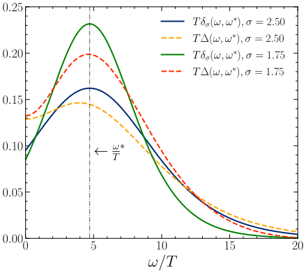

::: {.note style="text-align:center; margin-top:-0.2em"}
Reconstructed $\Delta$ vs target $\delta_\sigma$ at $\omega^*/T = p/T \simeq 4.71$.
:::
:::

:::
:::

## Fixing the coefficients: the HLT functional

  The $g_\tau(\omega^*)$ minimize a functional balancing accuracy and stability:

  $$F_\lambda[g] = (1-\lambda)\, A_\alpha[g] + \lambda\, B[g]$$

::: columns
::: column 
:::{class="fragment"}

1. Resolution Error (Bias)

  
$$A[g] = \int_{0}^\infty d\omega \, \left[ \Delta_\sigma  (\omega) - \delta_\sigma(\omega) \right]^2 e^{2\omega}$$
  
* Penalizes deviations from the **target** $\delta_\sigma$.
* Enforces the correct "smearing shape."

:::

:::

::: column 
::: {class="fragment"}

2. Statistical Error (Variance)

$$B[g] = \mathbf{g}^T \cdot \mathbf{Cov} \cdot \mathbf{g}$$
  
* Penalizes the **variance** of the estimator due to data noise.
* Reduces explosion of coefficients $g_\tau$.

:::

:::

:::

  The parameter $\lambda \in [0, 1)$ controls the trade-off.  
  (Unlike standard Backus-Gilbert, we fix $\sigma$ as an input and scan $\lambda$ for stability.)

---

## Three limits, two independent strategies

::: {style="font-size: 0.9em; margin-top: 2px;"}
A controlled result requires **three** limits:

1. **Continuum** $a \to 0\;$ at fixed $(\tau T,\, p/T,\, R_s T)$;
2. **Zero smoothing** $R_s \to 0\;$ (after $a \to 0$) → restores the physical short-distance behavior;
3. **Zero smearing width** $\sigma \to 0\;$ in the HLT inversion.
:::

::: {.fragment style="margin-top: 2.50em;"}

::: {style="text-align:center; font-size:0.85em; font-weight:bold; color:#9c162a;"}
Method 1 → extrapolate first, invert last
:::

::: {.flow}
[$G_E(\tau, p;\, a, R_s)$]{.box} [→]{.arrow} [$a \to 0$, then $R_s \to 0$]{.box} [→]{.arrow} [HLT]{.box .net} [→]{.arrow} [$\Gamma_{\mathrm{top}}(\omega, p)$]{.box}
:::

:::

::: {.fragment style="margin-top: 10px;"}

::: {style="text-align:center; font-size:0.85em; font-weight:bold; color:#3b7ea1;"}
Method 2 → invert first, extrapolate last
:::

::: {.flow}
[$G_E(\tau, p;\, a, R_s)$]{.box} [→]{.arrow} [HLT]{.box .net} [→]{.arrow} [$a \to 0$, then $R_s \to 0$]{.box} [→]{.arrow} [$\Gamma_{\mathrm{top}}(\omega, p)$]{.box}
:::

:::

::: {.fragment .lead style="text-align:center; margin-top: 26px;"}
Two different orderings of ill-conditioned steps: their **agreement** is a strong check  that all systematics are under control [[7]]{color=gray}.
:::

## Method 1: the double extrapolation

::: {style="text-align:center; font-size: 0.8em; margin-top:-1.0em; margin-bottom: 6px; color:#33474b;"}
$\frac{1}{T^5}G_E = \frac{1}{T^5}G_E\big|_{\mathrm{cont}} + C_1 (aT)^2$ at fixed $R_sT\;$ → $\;\frac{1}{T^5}G_E\big|_{\mathrm{cont}} = \frac{1}{T^5}G_E\big|_{R_s \to 0} + C_2 (R_sT)^2$
:::

::: columns
::: {.column width="50%" class="fragment"}
  
Step 1: Continuum limit ($a \to 0$)

  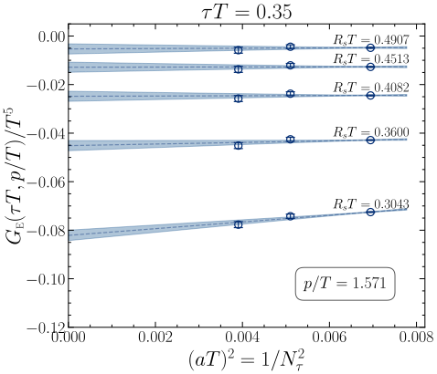
  
Smooth, almost flat: slope mildly dependent on $\tau T$, $R_s T$, $p/T$.

:::

::: {.column width="50%" class="fragment"}
  
Step 2: Zero-smoothing limit ($R_s \to 0$)

  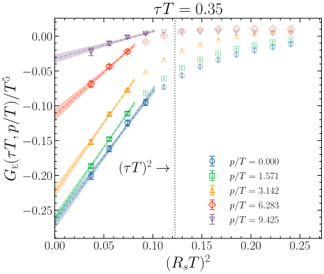
  
Linear in $(R_sT)^2$, fit range restricted to $R_s < \tau$.

:::
:::

  $R_s < \tau$ shrinks the usable window as $\tau$ decreases → reliable double limit for $0.25 \le \tau T \le 0.5$.

## Method 1: physical correlators recovered

::: columns
::: {.column width="50%" class="fragment"}
  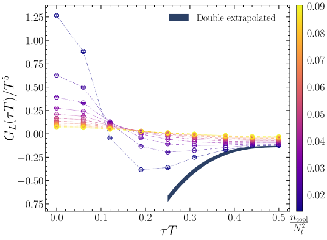
  

  Smoothing distorts short distances → $G_E > 0$ for $\tau \lesssim R_s$, violating reflection positivity. The double limit (band) restores $G_E < 0$ at all $\tau > 0$.
  

:::

::: {.column width="50%" class="fragment"}
  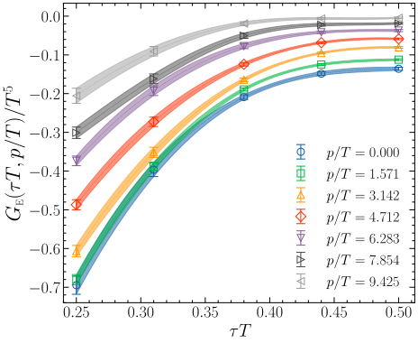
  

  Final double-extrapolated correlators for all momenta $p/T$.
  

:::
:::

**Observation:** $G_E(\tau, p)$ is **suppressed** with $p$ at every time separation. 
One might expect the rate to simply follow this suppression, <strong>but does it?!</strong>

## Method 1: HLT inversion at work

::: {style="text-align:center; font-size: 0.85em; margin-top:-6px; margin-bottom: 4px;"}
Inversion at $\omega^*/T = p/T \simeq 4.71$, for each $(\omega/T, p/T)$ pair, scan $\lambda$ and several $\sigma/T \in [1.25, 2.5]$
:::

::: columns
::: {.column width="50%" class="fragment"}
  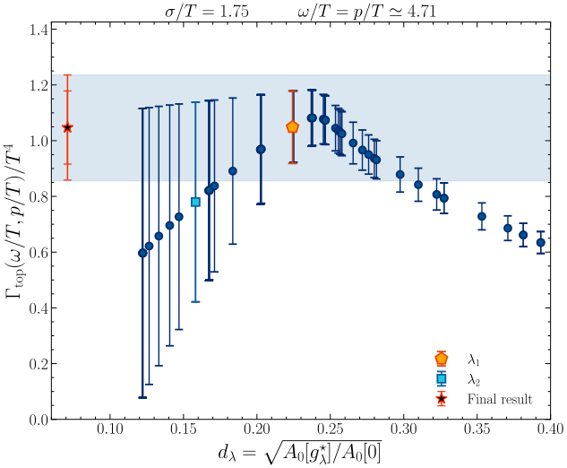
  

  Stability analysis: plateau for $d_\lambda \lesssim 0.3$; result from $\lambda_1$, systematic from $\lambda_2$ (summed in quadrature).
  

:::

::: {.column width="50%" class="fragment"}
  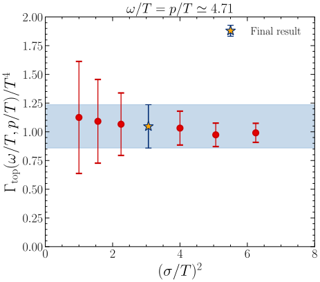
  

  Smearing-width dependence: flat within errors, as expected from $\Gamma_{\mathrm{top}}\big|_\sigma = \Gamma_{\mathrm{top}} + C\sigma^2 + \ldots$
  

:::
:::

::: {.fragment .lead style="text-align:center; margin-top: 10px;"}
No detectable $\sigma$-dependence → final values quoted at $\sigma/T = 1.75$, the middle of the explored range.
:::

## Method 2: invert first, extrapolate the rate

::: {.lead style="text-align:center; margin-top:-4px; margin-bottom:14px;"}
Invert the finite $(a, R_s)$ correlators, then repeat the **double limit on the rate** $\Gamma_{\mathrm{top}}$ itself.
:::

::: columns
::: {.column width="47%"}
  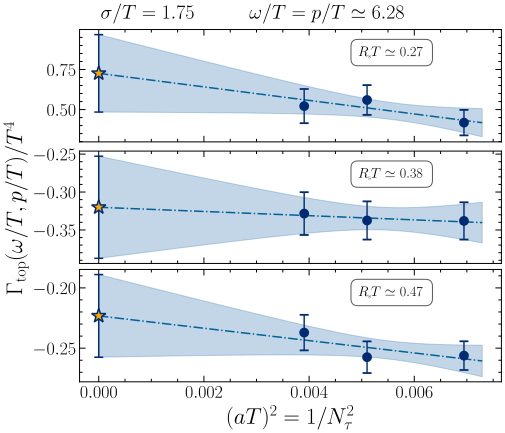

::: {.note .fragment .semi-fade-out fragment-index=1 style="text-align:center; margin-top:-4px;"}
Continuum limit at fixed $R_sT$ &nbsp;($\omega/T = p/T \simeq 6.28$): smooth, slope practically independent of $R_sT$.
:::
:::

::: {.column width="53%"}

::: {.fragment .card fragment-index=1 style="margin-top:2.5em; font-size:0.84em;"}
**Then $R_s \to 0$, on the rate**

* a **plateau** in $(R_sT)^2$ appears at small $R_s$;
* the scales driving $\Gamma_{\mathrm{top}}$ decouple from the UV cutoff $R_s$;
* plateau shrinks as $\omega/T$ grows — as expected.
:::

::: {.fragment .eqbox fragment-index=2 style="display:block; margin:22px auto 0; text-align:center; font-size:0.8em;"}
constant fit (err ×2.5) &amp; linear fit in $(R_sT)^2$ → **fully compatible**
:::

:::
:::

## Two orderings of the limits, one rate

::: {style="display:flex; justify-content:center; gap:1.6em; margin-top:-2px; margin-bottom:8px;"}
[★ Method 2 → invert, then extrapolate]{.chip}
[◇ Method 1 → extrapolate, then invert]{.chip}
:::

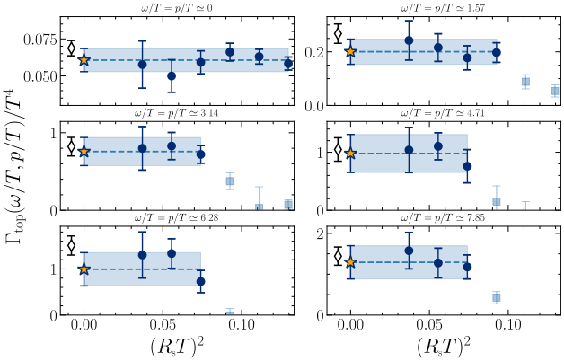

::: {.fragment .takeaway style="margin-top:10px; font-size:0.82em;"}
The two independent orderings **agree at every energy** &nbsp;→&nbsp; all systematics under control.
:::

## The on-shell rate grows with momentum {.money}

::: {style="text-align:center; font-size: 0.8em; margin-top:-10px; color:#33474b;"}
$\omega = p$ (axion kinematics). Plotted: $\;f(\omega)^{-1}\, \Gamma_{\mathrm{top}}/T^4 = \rho(\omega = p, p)/\omega$, with $f(\omega) = \frac{\omega/T}{1 - e^{-\omega/T}}$
:::

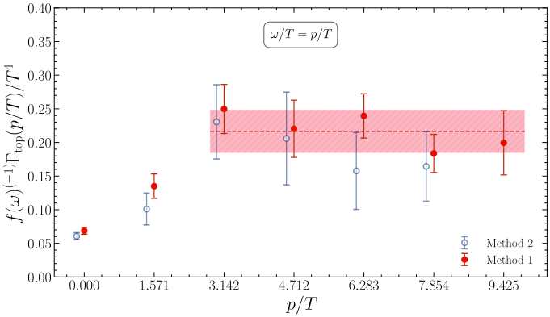

:::: {.columns}
::: {.column width="50%"}
::: {.fragment .lead style="text-align:center; font-size: 0.74em; margin-top: 0.2em"}
$\rho(p,p)/\omega$ reaches a **plateau** for $p/T \gtrsim 3$: 
$f^{-1}\Gamma_{\mathrm{top}}/T^4 \approx 0.216(32)$ &nbsp;⇒&nbsp; $\Gamma_{\mathrm{top}}(p)$ grows **linearly** in $p$, 
as predicted semiclassically: $\Gamma_{\mathrm{top}}(p) = p\,(\alpha_s T)^3 \left[A \log\frac{pT}{m_D^2} + B\right]$ [[9]]{color=gray}
:::
:::
::: {.column width="50%"}
::: {.fragment .lead style="text-align:center; font-size: 0.74em; margin-top: 0.2em"}
**No contradiction** with the suppression of $G_E$:  off-shell, $\Gamma_{\mathrm{top}}$ decreases with $p$ only at **fixed** $\omega$, while it **grows** with $\omega$ at fixed $p$. 
On the diagonal $\omega = p$ the growth wins.
:::
:::
::::

## Conclusions

1. **First lattice study of the real-time topological rate at $p \neq 0$:**
    * proof-of-concept in quenched SU(3) at $T \simeq 1.24\,T_c$, momenta up to $p/T \sim 10$;
    * HLT inversion of the topological charge density correlator.

2. **All systematics under control:**
    * three limits: $a \to 0$, $R_s \to 0$, $\sigma \to 0$, each shown to be controlled;
    * two independent strategies (extrapolate → invert vs invert → extrapolate) **agree**.

3. **Physics result:**
    * on-shell rate $\Gamma_{\mathrm{top}}(p)$ **increases linearly** with $p$; $\rho(p,p)/\omega$ plateaus at $\approx 0.216(32)\, T^4$ for $p/T \gtrsim 3$;
    * a non-trivial, first-principles input toward momentum-dependent axion Boltzmann equations.

**Outlook → full QCD at the physical point:**
temperature dependence, and the expected **light-quark enhancement** of the momentum-dependent rate.

# Thank you for your attention! {.center}

## Why bother? Naive inversion is a catastrophe

**Mock test**:  &nbsp; synthetic $G(\tau_i)$ from a known $\rho(\omega)$, tiny noise &nbsp; → &nbsp; naive inversion ${\rho} \sim K^{-1} G$

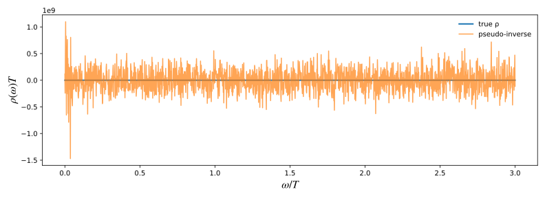

  Sub-percent fluctuations in the input explode into $\mathcal{O}(10^9)$ oscillations in the output. 
  The smeared, regularized HLT estimator is <strong>not optional</strong> — it is what makes the problem tractable.

## References

::: {style="font-size: 0.72em; line-height: 1.7;"}

[[1]]{color=gray} Fukushima, Kharzeev, Warringa, Phys. Rev. D 78 (2008) 074033 [arXiv:0808.3382]  
[[2]]{color=gray} Kharzeev, Liao, Tribedy, Int. J. Mod. Phys. E 33 (2024) 2430007 [arXiv:2405.05427]  
[[3]]{color=gray} Notari, Rompineve, Villadoro, Phys. Rev. Lett. 131 (2023) 011004 [arXiv:2211.03799]  
[[4]]{color=gray} Meyer, EPJA 47 (2011) 86 — Lowdon, Phys. Rev. D 106 (2022) 045028  
[[5]]{color=gray} Hansen, Lupo, Tantalo, Phys. Rev. D 99 (2019) 094508 [arXiv:1903.06476]  
[[6]]{color=gray} Bonati, D'Elia, Phys. Rev. D 89 (2014) 105005 [arXiv:1401.2441]  
[[7]]{color=gray} Bonanno, D'Angelo, D'Elia, Maio, Naviglio, Phys. Rev. D 108 (2023) 074515 [arXiv:2305.17120]  
[[8]]{color=gray} Bonanno, D'Angelo, D'Elia, Maio, Naviglio, Phys. Rev. Lett. 132 (2024) 051903 [arXiv:2308.01287]  
[[9]]{color=gray} Moore, Tassler, JHEP 02 (2011) 105 [arXiv:1011.1167] — Notari et al. [arXiv:2211.03799]  

:::

## Lattice setup

::: columns
::: {.column width="52%"}

::: {style="font-size: 0.82em; margin-top: 4px;"}
**Discretization:**  Wilson plaquette action, heat-bath + over-relaxation:
$$\mathcal{S}_{\mathrm{YM}}[U] = -\frac{\beta}{3} \sum_{x,\mu>\nu} \mathrm{Re}\,\mathrm{Tr}\left[U_{\mu\nu}(x)\right]$$

**Observable** 
Clover topological charge density $q_L(x)$ after **cooling**:
$$ Q_L^{\vec{p}}(n_t) = \sum_{\vec{n}} e^{i\vec{p}\cdot\vec{n}} q_L(n_t, \vec{n}) $$

and we compute the correlator:
  $$ G^{\vec{p}}(\tau) = \langle Q_L^{\vec{p}}(\tau) Q_L^{-\vec{p}}(0) \rangle $$

:::

:::
::: {.column width="48%"}

::: {style="font-size: 0.85em; text-align:center; margin-top: 0.2em;"}
**Line of Constant Physics:** $\;T \simeq 1.24\,T_c$, $\;LT = 4$
:::

<table class="simstab" style="font-size:0.85em;">
<tr><th>$N_s$</th><th>$N_\tau$</th><th>$\beta$</th><th>$a$ $\mathrm{[fm]}$</th><th>$T/T_c$</th><th>$\mathrm{Stat}$</th></tr>
<tr><td>48</td><td>12</td><td>6.440</td><td>0.0460(7)</td><td>1.244(18)</td><td>53.9k</td></tr>
<tr><td>56</td><td>14</td><td>6.559</td><td>0.0395(6)</td><td>1.242(18)</td><td>21.7k</td></tr>
<tr><td>64</td><td>16</td><td>6.665</td><td>0.0345(5)</td><td>1.244(18)</td><td>15.7k</td></tr>
</table>

::: {.fragment style="font-size: 0.85em; margin-top: 1.5em;"}
**Momenta** along $\hat x$, quantized by the spatial size:
$$ ap = \frac{2\pi}{N_s} k \;\;\Rightarrow\;\; \frac{p}{T} = \frac{\pi}{2}\, k, \quad k = 0, \ldots, 6 $$

::: {style="text-align:center; color:#8a9aa0; font-size: 0.9em; font-weight: 400; margin-top: 4px;"}
$LT=4$ (vs 3 of [[7]]{color=gray}) → finer momenta, up to $p/T \simeq 9.4$
:::
:::

:::
:::

  **Artifacts:**  Smoothing introduces a new scale $R_s = a\sqrt{\tfrac{8}{3} n_{\mathrm{cool}}} = \sqrt{8 t_{\mathrm{GF}}}$ [[6]]{color=gray} 
  <em style="color:#af1212ff">We must remove this dependence to recover physical results.</em>

## Off-shell Determination 

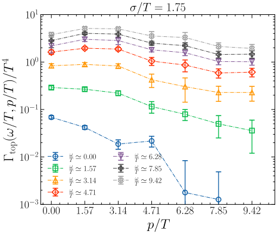